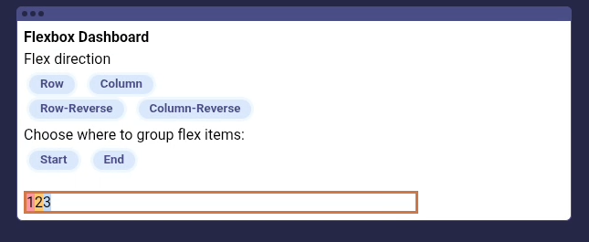
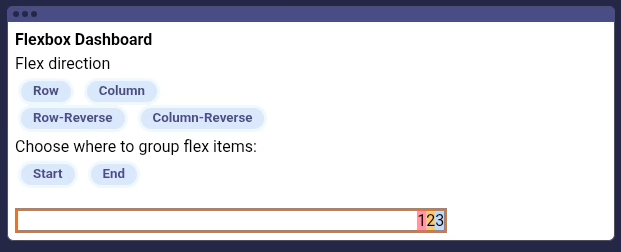
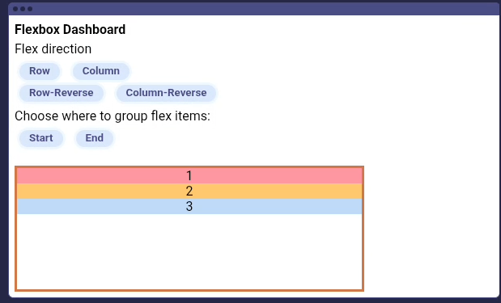
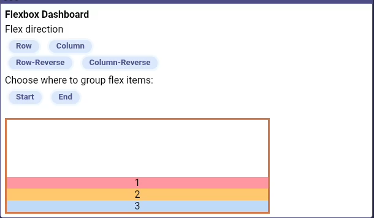
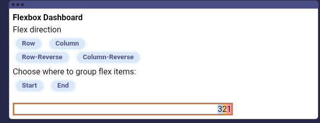
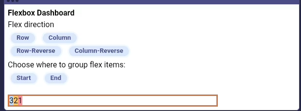
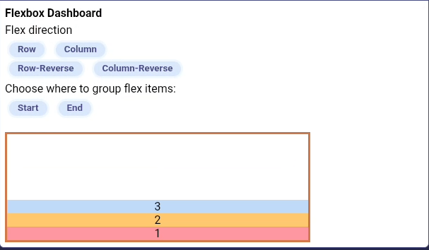
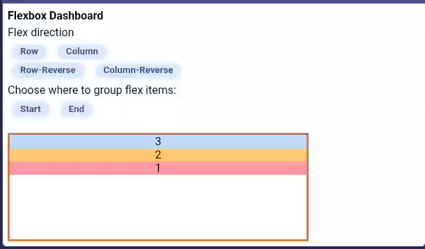

# Justificar
Significa cambiar como se agrupan y espacian los elementos en el eje principal, para justificar los elementos, usamos la propiedad justifi-content.

Por defecto justify-content esta configurado en:

```justify-content: flex-start;```

**Flex-start** significa que todos los elementos flexibles estan agrupados al principio del contenedor

Para agrupar todos los elementos al final del contenedor usamos flex-end

Justify-content tambien funciona cuando flex-direction esta configurado en column

``.container2 {
    border: solid 2px #806868;
    height: 30px;
    display: flex;
    flex-direction:column;
    justify-content:flex-end;
}
``

Con flex-direction configurado en column flex-end significa que todo el contenido esta agrupado en la parte inferior del contenedor

Prueba diferentes configuracion de flex-direction y justifi-content

``Flex-direction:row;  
Flex-direction:column;  
Flex-direction:row-reverse;  
Flex-direction:column-reverse; 

justify-content:flex-start;
justify-content:flex-end;
``
## Quiz

¿Que hace justify-content?
R:Organiza como se agrupan y espaciona los elementos en el eje principal

¿Que muestra este codigo?
R: Un grupo de elementos flex al inicio del eje principal

``
.container {
    border: solid 2px #806868;
    display: flex;
    justify-content:flex-start;
}

.item {
    border: 2px solid #457081;
}
``

¿Que hace flex-start?
R: Agrupa los elementos flex al comienzo del eje principal

¿Que esta mal en este codigo?
R: La propiedad justify-content debe estar dentro del contenedor flex

``
.container {
    border: solid 2px #806868;
    display: flex;
}

.item {
    border: 2px solid #457081;
    margin: 10px;
    justify-content: flex-start;
}
``

¿Que esta mal con este codigo?
R: No hay nada malo en este codigo

``
.container {
    border: solid 2px #806868;
    height: 300px;
    display: flex;
    flex-direction: column;
    justify-content: flex-start;
}

.item {
    border: 2px solid #457081;
    margin: 10px;
}
``

¿que muestra este codigo?
R: El numero 3 al final del contenedor

``
.container {
    border: solid 2px #806868;
    display: flex;
    flex-direction: row;
    justify: flex-end;
}

.item {
    border: 2px solid #457081;
    margin: 10px;
}
``

``
<!DOCTYPE html>
<html>
    <head>
        <link rel="stylesheet" href="style.css">
    </head>
    <body>
      <div class="container">
        <div class="item"> 1</div>
        <div class="item"> 2</div>
        <div class="item"> 3</div>
    </body>
</html>
``